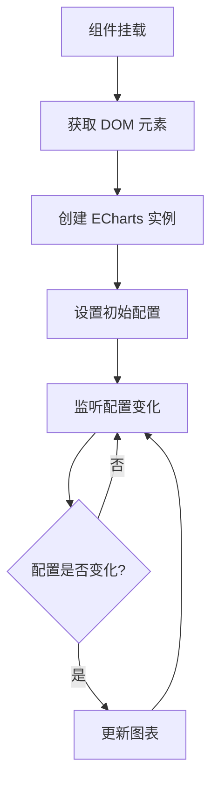

# Code Explainer Command

深入分析代码逻辑、工作原理和设计模式。

## 使用方法

### 解释当前文件
```bash
@explain
```

### 解释特定代码段
```bash
@explain src/stores/userStore.ts
```

### 解释选中的代码
```bash
# 在编辑器中选中代码后运行
@explain
```

### 生成架构图
```bash
@explain --architecture
```

### 生成流程图
```bash
@explain --flowchart
```

## 分析内容

### 1. 代码结构
- 文件组织
- 类/函数层次
- 模块依赖
- 导入导出关系

### 2. 核心逻辑
- 算法实现
- 数据流
- 状态变化
- 事件处理

### 3. 设计模式
- 识别的设计模式
- 架构风格
- 编程范式

### 4. 工作原理
- 执行流程
- 关键步骤
- 边界条件
- 错误处理

## 输出示例

```markdown
# 代码分析: useChartGenerator.ts

## 概述
这是一个用于生成和更新 ECharts 图表的 Vue 3 Composable。

## 核心功能
1. 图表初始化
2. 配置更新
3. 响应式尺寸调整
4. 销毁清理

## 代码结构

```
useChartGenerator()
├── initChart()     # 初始化图表实例
├── updateChart()   # 更新图表配置
├── resizeChart()   # 处理窗口缩放
└── destroyChart()  # 销毁图表
```

## 工作流程



## 关键代码解析

### 图表更新逻辑
\`\`\`typescript
watch(
  () => props.config,
  (newConfig) => {
    if (chartInstance) {
      chartInstance.setOption(newConfig, true);
    }
  },
  { deep: true }
);
\`\`\`

**说明**:
- 使用 `deep: true` 深度监听配置对象
- `setOption` 的第二个参数 `true` 表示不合并，完全替换
- 自动触发图表重绘

### 响应式尺寸
\`\`\`typescript
const resizeObserver = new ResizeObserver(() => {
  chartInstance?.resize();
});
\`\`\`

**说明**:
- 使用 ResizeObserver API 替代 window.resize
- 更精确地监听容器尺寸变化
- 性能更优

## 依赖关系
```
useChartGenerator
├── echarts (图表库)
├── vue (响应式系统)
└── @vueuse/core (工具函数)
```

## 设计模式
- **组合式模式**: 使用 Vue 3 Composition API
- **观察者模式**: watch 监听配置变化
- **单一职责**: 只负责图表生成，不处理业务逻辑

## 潜在问题
1. **内存泄漏风险**: 组件卸载时需要销毁图表实例
2. **性能问题**: 频繁更新可能导致性能问题
3. **错误处理**: 缺少对 DOM 元素不存在的情况处理

## 改进建议
1. 添加错误边界处理
2. 使用防抖优化频繁更新
3. 添加图表加载状态
```

## 可视化选项

### 架构图
```bash
@explain --architecture
```
生成模块关系和依赖图

### 流程图
```bash
@explain --flowchart
```
生成执行流程和时序图

### 时序图
```bash
@explain --sequence
```
生成交互时序图
